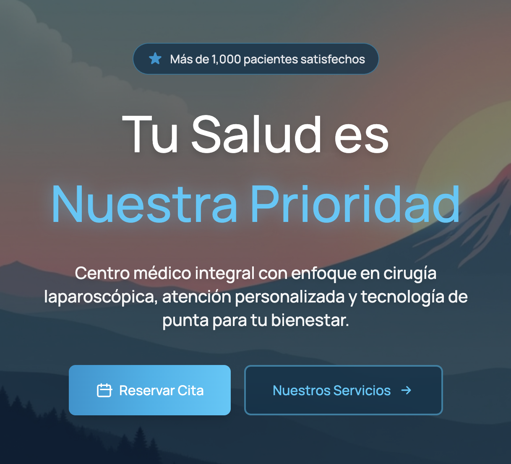

# Espíritu Joven AQP — Medical Services Landing Page  
**Enterprise-grade, responsive web interface built with React & TailwindCSS**

Espíritu Joven AQP es un consultorio médico especializado ubicado en Arequipa, Perú.  
Este proyecto consiste en una landing page corporativa desarrollada con enfoque en rendimiento, accesibilidad y experiencia de usuario, con el objetivo de presentar los servicios médicos de forma clara, confiable y moderna.

---

## 📸 Project Preview

  

---

## 🧭 Executive Summary

Este proyecto implementa una plataforma web ligera y optimizada que permite:

- Presentación profesional de servicios médicos.  
- Comunicación directa mediante formulario de contacto integrado.  
- Identidad visual alineada con la ubicación y esencia local (incluyendo el Volcán Misti).  
- Navegación fluida y adaptable a cualquier dispositivo.  

Diseñado con prácticas modernas de frontend, asegurando escalabilidad, mantenibilidad y facilidad de despliegue.

---

## 🛠 Tech Stack & Architecture

**Framework:** React JS  
**Compiler:** Vite  
**Styling:** TailwindCSS  
**Icons:** React Icons  
**Forms Backend:** Web3Forms  
**Deployment:** Vercel (CI/CD ready)

### Frontend Architecture Highlights

- Component-based modular structure  
- Optimized rendering using Vite’s native ESBuild pipeline  
- Responsive design system following Tailwind utility classes  
- Separation of UI, assets, logic and configuration  
- Reusable UI components for hero, services, navbar and forms  